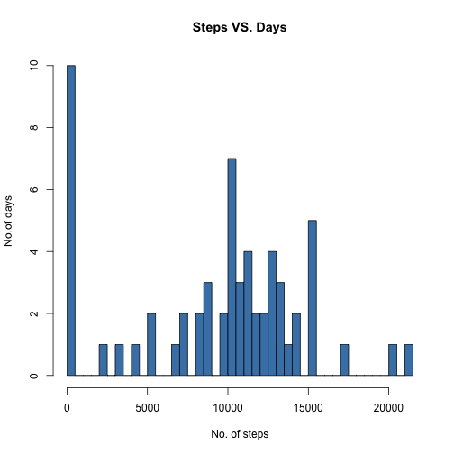
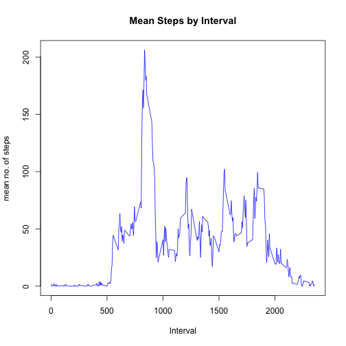
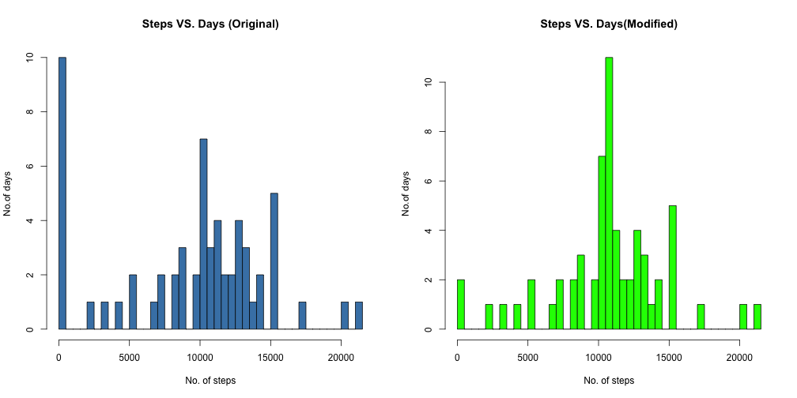
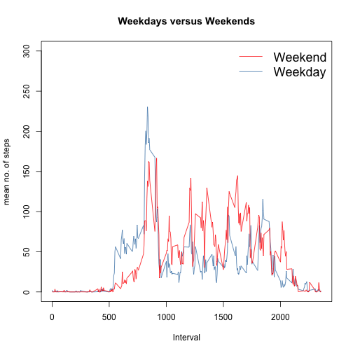

Reproducible Research: Peer Assessment 1
title: "Reproducible Research: Peer Assessment 1"
output: 
  html_document:
    keep_md: true
========================================================
### Required packages

This analysis requires the lubridate package. Please install the lubridate package before continuing with the rest of this report


```r
library(lubridate)
```

The goal of this analysis is to understand the activity patterns of our subjects over a period of time. The original dataset is a record of the number of steps taken for each five minute interval for each day over the course of October and November of 2012.

Our analysis will address the following questions:

- What is the mean total number of steps taken each day?
- What is the average daily pattern? (i.e. what is the mean and median number of steps taken  each day?)
- Is there a different trend for weekdays as compared to weekends?

### What is the mean total number of steps taken each day?

We'll begin by creating a historgram of the total number of steps taken each day. The x-axis represents the number of steps taken and the y-axis represents the number of days that our subject took those steps. For example, a bar with a range (x-axis) of 1000-1500 and a height of 4(y-axis) tells us that there were 4 days that our subject took 1000 to 1500 steps. Each bar has a width of 500 units.


```r
main<-read.csv("activity.csv")
tmp1<-split(main,main$date) ## splitting the dataset by date
totalsteps<-sapply(tmp1,function(x) sum(na.omit(x[,"steps"]))) ## summing the number of steps by date.
totalsteps<-as.data.frame(totalsteps) ## converting our data to a usable format.
totalsteps$date<-row.names(totalsteps)
row.names(totalsteps)<-1:nrow(totalsteps)
totalsteps<-totalsteps[,c(2,1)]
totalsteps$date<-ymd(totalsteps$date)

hist(totalsteps$totalstep,main="Steps VS. Days",xlab="No. of steps",ylab="No.of days",col="steelblue",breaks=40) ## plotting our histogram
```

 

The left most bar of the column (range: 0-500, height=10) tells us that there were 10 days were our subject took anywhere from 0 to 500 steps. This is due to the number of cells with no inputs for the "step" column. In total, there were eight days with no records of the number of steps our subject took. The histogram also indicates that the mean and median falls between 9000 and 12000. The code below gives us a six number summary(five number summary plus mean) of the number of steps taken each day.


```r
summary(totalsteps$totalsteps)
```

```
##    Min. 1st Qu.  Median    Mean 3rd Qu.    Max. 
##       0    6780   10400    9350   12800   21200
```

### What is the average daily pattern?

We begin by calculating the mean of each time interval. For example, the mean of the "0" interval (first five minutes of the day) is calculated by averaging the steps of all "0" intervals. Then, we'll plot these intervals as a time series. Intervals with no input for steps were ommited for this analysis.


```r
tmp2<-split(main,main$interval)
mean_interval<-sapply(tmp2,function(x) mean(na.omit(x[,"steps"])))
mean_interval<-as.data.frame(mean_interval)
mean_interval$interval<-row.names(mean_interval)
row.names(mean_interval)<-1:nrow(mean_interval)
mean_interval<-mean_interval[,c(2,1)]
colnames(mean_interval)<-c("interval","meansteps")

plot(mean_interval$interval,mean_interval$meansteps,type="l",main="Mean Steps by Interval",xlab="Interval",ylab="mean no. of steps",col="blue")
```

 

Our time series reveals that our subject is most active between 7am to 9am. He or she reaches a peak of 200 steps per interval during that time period. The next highest peaks around 12pm, 3pm and 6pm only reach 100 steps per interval. The code below reveals that our subject was most active at 8:35am in the morning.


```r
max_steps<-max(mean_interval$meansteps)
max_interval<-mean_interval[which(mean_interval$meansteps==max_steps),"interval"]
max_interval<-as.numeric(max_interval)
max_interval
```

```
## [1] 835
```

# Replacing Missing Values

As stated, there are eight days with no record of our subject's activity. We decided to replace these values with the mean values of the specific time interval. For example, the time interval 0 (first 5 minutes of the day) has a mean of 1.71 steps, so all interval 0's with NA were replaced with 1.71. The code below gives us the dates with missing entries and the number of missing entries for that respective dates.


```r
missing<-sum(is.na(main$steps))
## Interested in knowing what the missing values look like
missingtable<-main[is.na(main$steps),]
tmp3<-split(missingtable,missingtable$date)
missingdays<-sapply(tmp3,nrow)
missingdays[which(missingdays>0)]
```

```
## 2012-10-01 2012-10-08 2012-11-01 2012-11-04 2012-11-09 2012-11-10 
##        288        288        288        288        288        288 
## 2012-11-14 2012-11-30 
##        288        288
```

### Did our data change?

We would like to know if the results of our analysis would change sinced the replacement of the missing values and if so by how much. Therefore, we will plot a histogram and calculate the mean and median of the modified dataset. The code below provides our methodology for the modified dataset titled "newmain"


```r
tmp4<-merge(missingtable,mean_interval,by="interval")
tmp4<-tmp4[,-2]
colnames(tmp4)<-c("interval","date","steps")
tmp4<-tmp4[,c("steps","date","interval")]
nonmissingtable<-main[!is.na(main$steps),]
newmain<-rbind(tmp4,nonmissingtable)
newmain<-newmain[order(newmain$date,newmain$interval),]
```


```r
tmp5<-split(newmain,newmain$date)
totalsteps2<-sapply(tmp5,function(x) sum(na.omit(x[,"steps"])))
totalsteps2<-as.data.frame(totalsteps2)
totalsteps2$date<-row.names(totalsteps2)
row.names(totalsteps2)<-1:nrow(totalsteps2)
totalsteps2<-totalsteps2[,c(2,1)]
totalsteps2$date<-ymd(totalsteps$date)

par(mfrow=c(1,2))

hist(totalsteps$totalstep,main="Steps VS. Days (Original)",xlab="No. of steps",ylab="No.of days",col="steelblue",breaks=40)

hist(totalsteps2$totalstep,main="Steps VS. Days(Modified)",xlab="No. of steps",ylab="No.of days",col="green",breaks=40)
```

 

As expected, the number of days with 0 to 500 steps reduced from 10 to 2 and the number of days with 10500 to 11000 steps increased from 3 to 11. This is because there were eight days with missing values in the original dataset. All the time interval cells of these eight days were replaced with the mean of their respective time intervals.The code below compares the six number summary of the original dataset and the modified dataset. 


```r
summary(totalsteps$totalsteps)  ## original data
```

```
##    Min. 1st Qu.  Median    Mean 3rd Qu.    Max. 
##       0    6780   10400    9350   12800   21200
```

```r
summary(totalsteps2$totalsteps) ## modified data
```

```
##    Min. 1st Qu.  Median    Mean 3rd Qu.    Max. 
##      41    9820   10800   10800   12800   21200
```

While the third quartile and max value did not change, there was a significant increase of the first quartile value from 6780 to 9820. The mean and the median values also increased from 10400 to 10800 and 9350 to 10800 respectively.

# Weekdays versus Weekends

The following code splits the modified dataset into two sets, weekdays and weekends based on the date of each row. The average of each time interval is calculated for each set and then plotted together on the same graph if there is a difference between daily activity of weekdays and weekends.


```r
newmain$date<-ymd(newmain$date)
for (i in 1:nrow(newmain)){
        if (weekdays(newmain[i,2]) %in% c("Sunday", "Saturday"))
                newmain[i,4]<-"Weekend"
        else newmain[i,4]<-"Weekday"
}
names(newmain)<-c("steps","date","interval","WD")
tmp6<-split(newmain,newmain$WD)
Weekday<-tmp6[[1]]
Weekend<-tmp6[[2]]

tmp7<-split(Weekday,Weekday$interval)
mean_interval2<-sapply(tmp7,function(x) mean(na.omit(x[,"steps"])))
mean_interval2<-as.data.frame(mean_interval2)
mean_interval2$interval<-row.names(mean_interval2)
row.names(mean_interval2)<-1:nrow(mean_interval2)
mean_interval2<-mean_interval2[,c(2,1)]
colnames(mean_interval2)<-c("interval","meansteps")

tmp8<-split(Weekend,Weekend$interval)
mean_interval3<-sapply(tmp8,function(x) mean(na.omit(x[,"steps"])))
mean_interval3<-as.data.frame(mean_interval3)
mean_interval3$interval<-row.names(mean_interval3)
row.names(mean_interval3)<-1:nrow(mean_interval3)
mean_interval3<-mean_interval3[,c(2,1)]
colnames(mean_interval3)<-c("interval","meansteps")

par(mfrow=c(1,1))
plot(mean_interval2$interval,mean_interval2$meansteps,type="l",main="Weekdays versus Weekends",xlab="Interval",ylab="mean no. of steps",col="steelblue",ylim=c(0,300))
with(mean_interval3,lines(mean_interval3$interval,mean_interval3$meansteps,type="l",main="Weekend",xlab="Interval",ylab="mean no. of steps",col="red",ylim=c(0,300)))
legend("topright",pch="",bty="n",lwd="1",col=c("red","steelblue"),legend=c("Weekend","Weekday"),cex=1.5,inset=0)
```

 

The graph shows that our subject is generally more active before 10am on weekdays but more active after 10am on weekends.

This concludes our analysis of the dataset.
